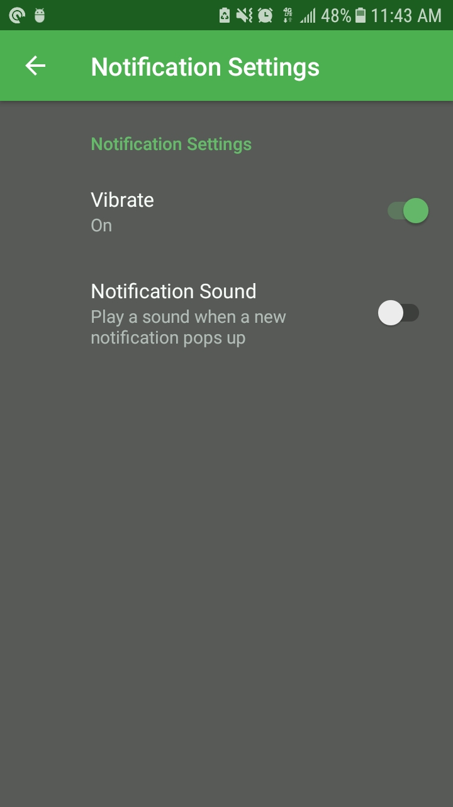
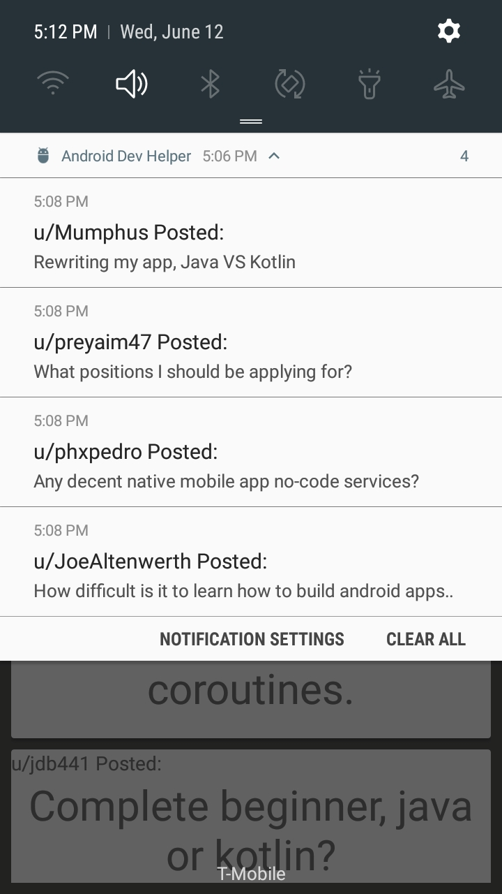

# Android Dev Helper
I was quite disappointed when I found out that there's no setting on reddit to receive a notification for a new post on a certain subreddit. So I decided to create an app that does just that but specifically for r/androiddev since it's my most used subreddit.

  
   
   

## Installing
To install go to android studio -> file-> new-> project from version control-> Git-> paste in this url: https://github.com/That1guy17/AndroidDevHelper    

You can then install from android studio.

## Primarily Built With
* RxJava 
* Retrofit
* Architecture Components
* Dagger2
* FireStore

## Contributing 
If you wish to contribute to this project email me first at takariharrison@gmail.com

## How it Works
I used a foreground service that makes a network call to r/androiddev every minute using Retrofit.
If there's any new post it then stores the post data in a Room data base which the PostListActivity's recycler view observes. And of course it prompts the user with a notification as well. 
