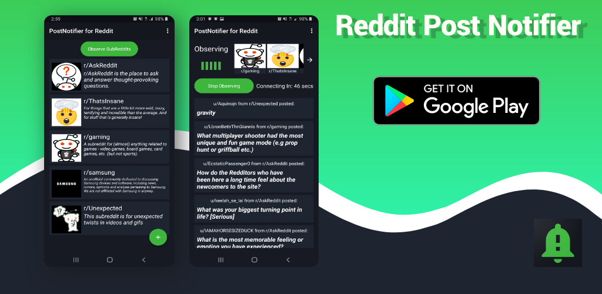

<h1 align="center">Reddit Post Notifier</h1>

  

Reddit Post Notifier keeps you up to date with post from your favorite communities. It allows you to simultaneously observe new post from 12 subreddits at a time.

## Download
You can download it directly from Google Play [right here.](https://play.google.com/store/apps/details?id=com.harrison.redditpostnotifier)

## Tech stack & Open-source libraries
- Built 100% using Kotlin
- [Dagger Hilt](https://developer.android.com/training/dependency-injection/hilt-android) - Reduces the boilerplate of doing manual dependency injection in your project.
- [Retrofit2 & OkHttp3](https://github.com/square/retrofit) - abstracts complexity of REST API communication.
- [GSON Converter](https://github.com/square/retrofit/tree/master/retrofit-converters/gson) - for JSON serialization and deserialization.
- [Coroutines](https://kotlinlang.org/docs/coroutines-overview.html) - Simplifies the the complexity of asynchronous programs.
- [Coil](https://coil-kt.github.io/coil/) - An image loading library for Android backed by Kotlin Coroutines.
- [Kotlin Flow](https://kotlinlang.org/docs/reference/coroutines/flow.html) - used for cold observables,
- [Toasty](https://github.com/GrenderG/Toasty) - creates beautiful custom made Toast with background colors, icons, etc.
- [Room](https://developer.android.com/training/data-storage/room) - abstracts the complexity of managing SQL databases
- [Android-SpinKit](https://github.com/ybq/Android-SpinKit) - gives access to an array of loading views.
- [Lottie](https://airbnb.io/lottie/#/android) - gives access to many user created animations.

## Architecture
Reddit Post Notifier is built based on the MVVM architecture and the Repository pattern. 

## Open API

Reddit Post Notifier uses [Reddit's Open API](https://www.reddit.com/dev/api/) for observing new post.

It's API enabled free access to highly detailed data related objects pertaining to subreddits, post, users, and comments.
